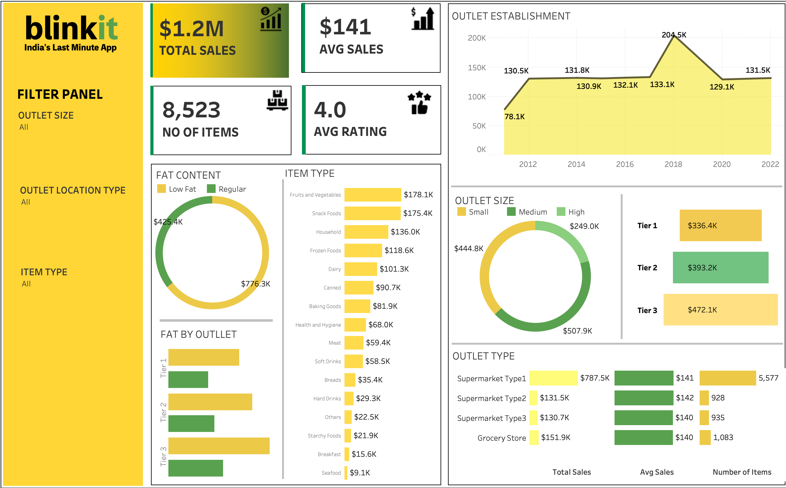

# Blinkit-Sales-Analysis
Simulated a real-world retail scenario using mock Blinkit data. Cleaned data and computed KPIs in SQL, then built an interactive Tableau dashboard to reveal sales patterns by item type, outlet size, and region — showcasing practical BI and storytelling skills.

 🛒 FMCG Retail Sales Dashboard | SQL + Tableau

A full-stack data analytics project using SQL and Tableau to simulate real-world FMCG sales insights. This dashboard visualizes product and outlet performance across dimensions like item type, fat content, outlet size, and location — built on mock data.

---

 🔍 Problem Statement

The goal is to help stakeholders in the FMCG space answer critical business questions like:
- Which item categories and fat content types generate the highest sales?
- How do outlet size and location tier impact performance?
- What patterns emerge from outlet establishment trends?

---

 🛠 Tools Used

- **SQL** (PostgreSQL) – Data cleaning, transformation, KPI extraction
- **Tableau Public** – Dashboard building and interactivity
- **Mock Dataset** – Simulated retail dataset resembling real FMCG sales behavior

---

 📊 Dashboard Preview

🔗 **Live Dashboard on Tableau Public:**  
[👉 Click here to view]([https://public.tableau.com/app/profile/yourname/viz/FMCGRetailSalesDashboard](https://public.tableau.com/views/Blinkit_data_analysis_public/Dashboard1?:language=en-US&:sid=&:redirect=auth&:display_count=n&:origin=viz_share_link))

---

 📈 Key KPIs Tracked

- Total Sales (₹)
- Average Sales per Item
- Average Customer Rating
- Total Number of Transactions

---

## 🔍 Key Segmentations Visualized

- Item Type
- Item Fat Content
- Outlet Size (Small / Medium / Large)
- Location Tier (Tier 1 / 2 / 3)
- Establishment Year of Outlet

---

## SQL Logic Overview

See [`sql/full_sql_workflow.sql`](Blinkit_full_sql_workflow.sql) for:
- Data cleaning logic (standardizing fat content, handling nulls)
- KPI calculations (total sales, avg sales, avg rating)
- Grouped analysis by item type, outlet size, and more

## Insights Delivered

- **Tier 1 cities and large outlets** are major sales drivers
- **"Low Fat"** items show stronger performance across locations
- Certain item types (e.g., **Frozen Foods, Household**) consistently outperform others

## Future Enhancements

- Add Python-based time-series forecasting for category-level sales
- Embed Tableau dashboard in a personal portfolio website
- Connect live data via Google Sheets + Tableau for real-time updates

